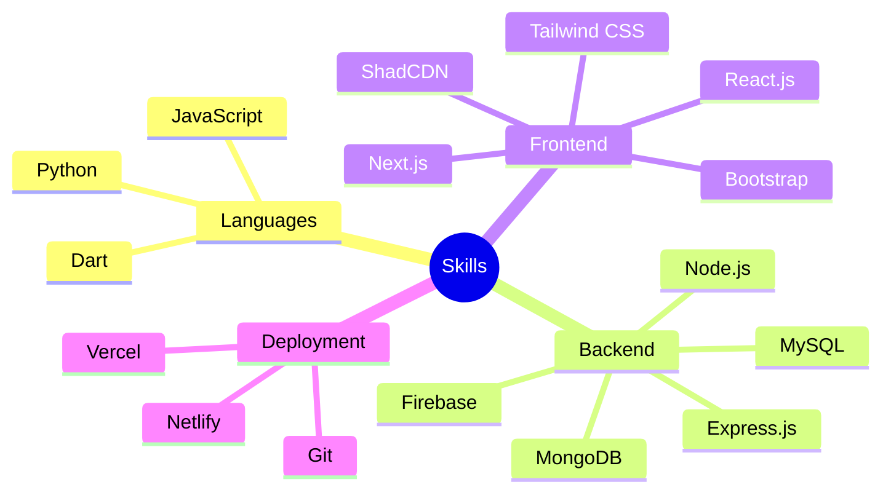

<!--  <h1 align="center">Hi, I'm Misbah Haque</h1>
<h3 align="center">A Passionate Full-Stack Developer in Progress</h3>

 
<!--     -->
<!--  

---

<h3 align="center">Tech Snapshot </h3>

---

<h3 align="center">📊 GitHub Stats</h3>

  
  

  

  

        

 -->
I'm a solution-oriented Front-end Developer, lifelong learner, and adventurer with a professional background in Software Engineering. I enjoy development because of the satisfaction I get by overcoming changes. I have an Engineer mindset. Frameworks and languages are tools for me. What matters is that the problem is solved more cleanly and conveniently. Connect with me to discuss how I can help you or your organization!

